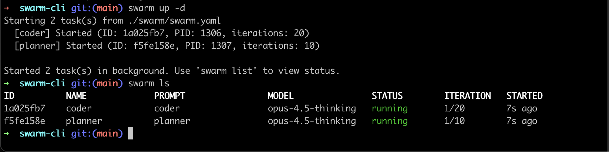

# Swarm CLI

A command-line tool for orchestrating AI agents. Initialize a project, describe what you want to build, and let a swarm of agents iterate on it autonomously.



```bash
# Initialize a project — pick a template, describe your plan
swarm init

# Start the pipeline in the background
swarm up -d

# Monitor agents in real-time
swarm top

# Shut everything down when you're done
swarm kill-all
```

## Table of Contents

- [Features](#features)
- [Installation](#installation)
  - [Prerequisites](#prerequisites)
  - [Download Binary (Recommended)](#download-binary-recommended)
  - [Install with Go](#install-with-go)
  - [Build from Source](#build-from-source)
- [Choosing Your Agent Backend](#choosing-your-agent-backend)
  - [Set Your Backend](#set-your-backend)
- [Quick Start](#quick-start)
- [Commands](#commands)
  - [swarm run](#swarm-run)
  - [swarm up](#swarm-up)
  - [swarm list](#swarm-list)
  - [swarm inspect](#swarm-inspect-task-id-or-name)
  - [swarm update](#swarm-update-task-id-or-name)
  - [swarm kill](#swarm-kill-task-id-or-name)
  - [swarm stop](#swarm-stop-task-id-or-name)
  - [swarm start](#swarm-start-task-id-or-name)
  - [swarm logs](#swarm-logs-task-id-or-name)
  - [swarm config](#swarm-config)
- [Configuration](#configuration)
  - [Configuration File](#configuration-file)
  - [Backends](#backends)
- [Prompts](#prompts)
  - [Prompt Locations](#prompt-locations)
  - [Creating Prompts](#creating-prompts)
  - [Using Prompts](#using-prompts)
- [Scoping](#scoping)
  - [Project Scope (default)](#project-scope-default)
  - [Global Scope](#global-scope---global---g)
- [Workflow Examples](#workflow-examples)
  - [Continuous Development](#continuous-development)
  - [Managing Long-Running Agents](#managing-long-running-agents)
  - [Multi-Project Setup](#multi-project-setup)
  - [Running Multiple Tasks (Compose)](#running-multiple-tasks-compose)
  - [Pipelines & DAG Execution](#pipelines--dag-execution)
- [Troubleshooting](#troubleshooting)
- [License](#license)

## Features

- **Run agents** with custom prompts (single or multiple iterations)
- **Automatic restart on failure** when running multiple iterations
- **Manage running agents** - list, view details, and control them
- **Live configuration updates** - change model or iterations while agents are running
- **Multiple backends** - supports Cursor's agent CLI and Claude Code CLI
- **Project & global scoping** - organize prompts and agents per-project or globally
- **Pipelines & DAG execution** - define task dependencies with conditional branching (success/failure/any/always)
- **Configurable** - TOML configuration with sensible defaults

## Installation

### Prerequisites

You need one of the supported agent backends installed:
- [Cursor](https://cursor.sh) with the `agent` CLI
- [Claude Code](https://docs.anthropic.com/en/docs/claude-code) CLI

### Download Binary (Recommended)

Download the latest binary for your platform from the [releases page](https://github.com/mj1618/swarm-cli/releases/latest).

**macOS (Apple Silicon):**
```bash
curl -L https://github.com/mj1618/swarm-cli/releases/download/latest/swarm-cli_darwin_arm64.tar.gz | tar xz -C /tmp
sudo mv /tmp/swarm /usr/local/bin/
```

**macOS (Intel):**
```bash
curl -L https://github.com/mj1618/swarm-cli/releases/download/latest/swarm-cli_darwin_amd64.tar.gz | tar xz -C /tmp
sudo mv /tmp/swarm /usr/local/bin/
```

**Linux (x64):**
```bash
curl -L https://github.com/mj1618/swarm-cli/releases/download/latest/swarm-cli_linux_amd64.tar.gz | tar xz -C /tmp
sudo mv /tmp/swarm /usr/local/bin/
```

**Linux (ARM64):**
```bash
curl -L https://github.com/mj1618/swarm-cli/releases/download/latest/swarm-cli_linux_arm64.tar.gz | tar xz -C /tmp
sudo mv /tmp/swarm /usr/local/bin/
```

### Install with Go

If you have Go installed:

```bash
go install github.com/mj1618/swarm-cli@latest
```

### Build from Source

```bash
git clone https://github.com/mj1618/swarm-cli.git
cd swarm-cli
go build -o swarm .
sudo mv swarm /usr/local/bin/
```

## Choosing Your Agent Backend

Swarm CLI supports two agent backends. Choose one based on what you have installed:

| Backend | CLI Command | Best For |
|---------|-------------|----------|
| **Cursor** | `agent` | Cursor IDE users with agent CLI access |
| **Claude Code** | `claude` | Standalone Claude Code CLI users |

### Set Your Backend

```bash
# Use Claude Code CLI (default)
swarm config set-backend claude-code

# Use Cursor's agent CLI
swarm config set-backend cursor
```

To verify your chosen backend is working:

```bash
# For Cursor
agent --version

# For Claude Code
claude --version
```

The backend can also be configured per-project in `swarm/swarm.toml` or globally in `~/.config/swarm/config.toml`. See the [Configuration](#configuration) section for details.

## Quick Start

1. **Create a prompt file** at `./swarm/prompts/my-task.md`:
   ```markdown
   # My Task
   
   Please do the following:
   - Step 1
   - Step 2
   - Step 3
   ```

2. **Run an agent**:
   ```bash
   swarm run -p my-task
   ```

3. **Or run multiple iterations**:
   ```bash
   swarm run -p my-task -n 10
   ```

## Commands

### `swarm run`

Run an agent with a specified prompt. By default runs a single iteration; use `-n` to run multiple iterations.

```bash
swarm run [flags]
```

**Flags:**
| Flag | Short | Description |
|------|-------|-------------|
| `--prompt` | `-p` | Prompt name from the prompts directory |
| `--prompt-file` | `-f` | Path to an arbitrary prompt file |
| `--prompt-string` | `-s` | Direct prompt text |
| `--model` | `-m` | Model to use (overrides config) |
| `--iterations` | `-n` | Number of iterations (default: 1) |
| `--name` | `-N` | Name for the agent (for easier reference) |
| `--detach` | `-d` | Run in background (detached mode) |

**Examples:**
```bash
# Interactive prompt selection
swarm run

# Use a named prompt (single iteration)
swarm run -p my-task

# Run 10 iterations
swarm run -p my-task -n 10

# Run with a name for easier reference
swarm run -p my-task -n 50 --name my-agent

# Use a specific file
swarm run -f /path/to/prompt.md

# Direct prompt string
swarm run -s "Fix all linter errors in the codebase"

# Specify a model
swarm run -p my-task -m gpt-5.2

# Run in background
swarm run -p my-task -n 20 -d
```

### `swarm up`

Run multiple tasks defined in a compose file (`./swarm/swarm.yaml` by default). Similar to `docker compose up`.

```bash
swarm up [task...] [flags]
```

**Flags:**
| Flag | Short | Description |
|------|-------|-------------|
| `--file` | `-f` | Path to compose file (default: `./swarm/swarm.yaml`) |
| `--detach` | `-d` | Run all tasks in background |

**Examples:**
```bash
# Run all tasks from ./swarm/swarm.yaml
swarm up

# Run specific tasks only
swarm up frontend backend

# Run in detached mode
swarm up -d

# Use a custom compose file
swarm up -f custom.yaml
```

See [Running Multiple Tasks (Compose)](#running-multiple-tasks-compose) for compose file format.

### `swarm list`

List running agents with their status and configuration.

```bash
swarm list [flags]
```

By default, only shows agents started in the current directory. Use `--global` to show all agents.

**Output columns:**
- `ID` - Unique agent identifier
- `PROMPT` - The prompt being used
- `MODEL` - The model being used
- `STATUS` - Current status (running/terminated)
- `ITERATION` - Current iteration / total iterations
- `DIRECTORY` - Working directory (global mode only)
- `STARTED` - Time since agent started

**Examples:**
```bash
# List agents in current project
swarm list

# List all agents globally
swarm list --global
```

### `swarm inspect [task-id-or-name]`

View detailed information about a specific agent. You can reference the agent by its ID or name. Alias: `view`

```bash
swarm inspect abc123       # by ID
swarm inspect my-agent     # by name
```

**Output includes:**
- Agent ID and PID
- Prompt and model
- Status with color coding
- Start time and duration
- Current iteration progress
- Working directory
- Termination mode (if set)
- Log file location (if available)

### `swarm update [task-id-or-name]`

Update the configuration of a running agent or terminate it. You can reference the agent by its ID or name. Alias: `control`

```bash
swarm update [task-id-or-name] [flags]
```

**Flags:**
| Flag | Description |
|------|-------------|
| `--iterations`, `-n` | Set new iteration count |
| `--model`, `-m` | Change model (applies on next iteration) |
| `--terminate` | Terminate immediately |
| `--terminate-after` | Terminate after current iteration completes |

**Examples:**
```bash
# Terminate immediately
swarm update abc123 --terminate

# Graceful termination after current iteration
swarm update abc123 --terminate-after

# Increase iterations to 100
swarm update abc123 -n 100

# Switch to a faster model
swarm update abc123 -m sonnet-4.5

# Multiple changes at once
swarm update abc123 -n 50 -m gpt-5.2
```

### `swarm kill [task-id-or-name]`

Terminate a running agent. This is a shortcut for `swarm control --terminate`.

```bash
swarm kill [task-id-or-name] [flags]
```

**Flags:**
| Flag | Description |
|------|-------------|
| `--graceful`, `-g` | Terminate after current iteration completes |

**Examples:**
```bash
# Terminate immediately
swarm kill abc123

# Terminate by name
swarm kill my-agent

# Graceful termination (wait for current iteration)
swarm kill abc123 --graceful
```

### `swarm stop [task-id-or-name]`

Pause a running agent after the current iteration completes.

```bash
swarm stop abc123
swarm stop my-agent
```

### `swarm start [task-id-or-name]`

Resume a paused agent.

```bash
swarm start abc123
swarm start my-agent
```

### `swarm logs [task-id-or-name]`

View the log output of a detached agent. Alias: `tail`

```bash
swarm logs [task-id-or-name] [flags]
```

**Flags:**
| Flag | Description |
|------|-------------|
| `--follow`, `-f` | Follow the output in real-time |
| `--tail` | Number of lines to show from end (default: 50) |

**Examples:**
```bash
# Show last 50 lines
swarm logs abc123

# Follow output in real-time
swarm logs my-agent -f

# Show last 100 lines
swarm logs abc123 --tail 100
```

### `swarm config`

Manage swarm-cli configuration.

#### `swarm config show`

Display the effective configuration after merging all sources.

```bash
swarm config show
```

#### `swarm config path`

Show configuration file locations and their status.

```bash
swarm config path
```

#### `swarm config set-backend [backend]`

Switch between agent backends.

```bash
# Use Cursor's agent CLI
swarm config set-backend cursor

# Use Claude Code CLI
swarm config set-backend claude-code

# Update global config instead of project
swarm config set-backend claude-code --global
```

## Configuration

Swarm CLI uses TOML configuration files with the following priority (highest to lowest):

1. CLI flags
2. Project config (`swarm/swarm.toml`)
3. Global config (`~/.config/swarm/config.toml`)
4. Built-in defaults

**Note:** Config is always loaded from your **current directory** when running the CLI, not from the directory where an agent was originally started. For example, if you start an agent in `/project-a/` and later run `swarm restart my-agent` from `/project-b/`, the restarted agent will use `/project-b/`'s config (but still run in `/project-a/`'s directory).

### Configuration File

```toml
# swarm-cli configuration

# Backend: "cursor" or "claude-code"
backend = "claude-code"

# Default model for agent runs
model = "opus"

# Default iterations for run command
iterations = 1

# Agent command configuration
[command]
executable = "claude"
args = [
  "-p",
  "--model", "{model}",
  "--dangerously-skip-permissions",
  "{prompt}"
]
raw_output = true
```

### Backends

#### Cursor (`cursor`)

Uses Cursor's `agent` CLI with JSON streaming output and log parsing.

**Default model:** `opus-4.5-thinking`

**Available models** (run `agent --list-models` for full list):
- `opus-4.5-thinking` - Claude 4.5 Opus (Thinking) - default
- `sonnet-4.5-thinking` - Claude 4.5 Sonnet (Thinking)
- `opus-4.5` - Claude 4.5 Opus
- `sonnet-4.5` - Claude 4.5 Sonnet
- `gpt-5.2` - GPT-5.2
- `gpt-5.2-codex` - GPT-5.2 Codex
- `gemini-3-pro` - Gemini 3 Pro
- `gemini-3-flash` - Gemini 3 Flash
- `grok` - Grok

#### Claude Code (`claude-code`)

Uses Anthropic's `claude` CLI with direct text streaming.

**Default model:** `opus`

**Available models:**
- `opus` - Claude Opus
- `sonnet` - Claude Sonnet

## Prompts

Prompts are markdown files that contain instructions for the agent.

### Prompt Locations

| Scope | Directory |
|-------|-----------|
| Project | `./swarm/prompts/` |
| Global | `~/swarm/prompts/` |

### Creating Prompts

Create a markdown file in the prompts directory:

```bash
mkdir -p ./swarm/prompts
cat > ./swarm/prompts/refactor.md << 'EOF'
# Refactoring Task

Please refactor the codebase with the following goals:

## Objectives
- Improve code readability
- Extract common patterns into reusable functions
- Add appropriate error handling
- Update documentation

## Constraints
- Do not change public API signatures
- Maintain backward compatibility
- Keep all tests passing
EOF
```

### Using Prompts

```bash
# By name (without .md extension)
swarm run -p refactor

# Interactive selection (when no -p flag)
swarm run

# From arbitrary file path
swarm run -f ~/my-prompts/special-task.md

# Direct string (for quick one-off tasks)
swarm run -s "Add unit tests for the user authentication module"
```

## Scoping

Swarm CLI supports two scopes for organizing work:

### Project Scope (default)

- Prompts: `./swarm/prompts/`
- Agents: Only shows agents started in the current directory
- Config: `swarm/swarm.toml`

### Global Scope (`--global` / `-g`)

- Prompts: `~/swarm/prompts/`
- Agents: Shows all agents across all directories
- Config: `~/.config/swarm/config.toml`

**Examples:**
```bash
# List only this project's agents
swarm list

# List all agents globally
swarm list -g

# Use global prompts directory
swarm run -g -p shared-task
```

## Workflow Examples

### Continuous Development

Run an agent continuously to work on a task:

```bash
# Create a task prompt
cat > ./swarm/prompts/dev-loop.md << 'EOF'
Check the current state of the codebase and continue working on:
1. Any failing tests - fix them
2. Any TODO comments - implement them  
3. Any linter warnings - resolve them
4. Code quality improvements

After each change, run the test suite to verify.
EOF

# Start the agent for 50 iterations
swarm run -p dev-loop -n 50
```

### Managing Long-Running Agents

```bash
# Start an agent in the background
swarm run -p my-task -n 100 -d

# Check on running agents
swarm list

# View details of a specific agent
swarm inspect abc123

# Extend the iterations
swarm update abc123 -n 200

# Pause the agent
swarm stop abc123

# Resume the agent
swarm start abc123

# Gracefully stop after current iteration
swarm kill abc123 --graceful
```

### Multi-Project Setup

```bash
# Set up global config with preferred backend
swarm config set-backend cursor --global

# Create project-specific overrides
cd ~/projects/frontend
swarm config set-backend cursor
# Edit swarm/swarm.toml to use faster model for frontend work

cd ~/projects/backend  
swarm config set-backend cursor
# Edit swarm/swarm.toml to use more capable model for backend work
```

### Running Multiple Tasks (Compose)

Define multiple tasks in a `swarm.yaml` file and run them all with a single command, similar to docker compose.

**Create a compose file** at `./swarm/swarm.yaml`:

```yaml
version: "1"
tasks:
  frontend:
    prompt: frontend-task
    model: sonnet-4.5
    iterations: 10

  backend:
    prompt: backend-task
    iterations: 5

  tests:
    prompt-string: "Run all tests and fix any failures"
    iterations: 20
```

**Run all tasks:**

```bash
# Run all tasks from ./swarm/swarm.yaml
swarm up

# Run in detached mode (background)
swarm up -d

# Run specific tasks only
swarm up frontend backend

# Use a custom compose file
swarm up -f custom.yaml
```

**Compose file options:**

| Field | Description |
|-------|-------------|
| `prompt` | Name of a prompt from the prompts directory |
| `prompt-file` | Path to an arbitrary prompt file |
| `prompt-string` | Direct prompt text |
| `model` | Model to use (optional, overrides config) |
| `iterations` | Number of iterations (optional, default: 1) |
| `name` | Custom agent name (optional, defaults to task name) |
| `prefix` | Text prepended to the prompt at runtime (optional) |
| `suffix` | Text appended to the prompt at runtime (optional) |
| `depends_on` | Task dependencies for pipeline/DAG execution (optional) |

Only one prompt source is allowed per task (`prompt`, `prompt-file`, or `prompt-string`).

**Example: Full-stack development workflow:**

```yaml
version: "1"
tasks:
  api-improvements:
    prompt: api-improvements
    model: opus-4.5-thinking
    iterations: 10

  frontend-features:
    prompt: frontend-features
    model: sonnet-4.5
    iterations: 15

  documentation:
    prompt-file: ./docs/doc-updates.md
    iterations: 5

  code-review:
    prompt-string: "Review recent changes for bugs and security issues"
    name: reviewer
    iterations: 3
```

```bash
# Start all tasks in background
swarm up -d

# Monitor progress
swarm list

# View specific task logs
swarm logs api-improvements
```

#### Pipelines & DAG Execution

Tasks can declare dependencies on other tasks using `depends_on`, forming a DAG (Directed Acyclic Graph). Wrap these in a `pipelines` section to run the full DAG across multiple iterations.

**Dependencies:**

Dependencies support both a simple form (task name as a string) and a full form with a condition:

```yaml
tasks:
  analyze:
    prompt: analyze-code

  implement:
    prompt: write-code
    depends_on: [analyze]          # Simple form: runs after analyze succeeds

  test:
    prompt: run-tests
    depends_on:
      - task: implement
        condition: success         # Full form with explicit condition

  fix:
    prompt: fix-errors
    depends_on:
      - task: test
        condition: failure         # Only runs if tests failed

  report:
    prompt-string: "Summarize results"
    depends_on:
      - task: test
        condition: any             # Runs whether tests passed or failed

  cleanup:
    prompt-string: "Clean up temp files"
    depends_on:
      - task: report
        condition: always          # Runs even if report was skipped
```

**Dependency conditions:**

| Condition | Behavior |
|-----------|----------|
| `success` (default) | Task runs only if the dependency succeeded |
| `failure` | Task runs only if the dependency failed |
| `any` | Task runs if the dependency completed (success or failure) |
| `always` | Task runs after the dependency reaches any terminal state, even if skipped |

Tasks with unsatisfied conditions are **skipped** — for example, if a task depends on another with `condition: success` but that dependency failed, the dependent task is skipped.

**Pipelines:**

The `pipelines` section defines named workflows that run the DAG for multiple iterations. Each iteration runs the entire DAG to completion before the next begins.

```yaml
version: "1"

tasks:
  plan:
    prompt: planner

  code:
    prompt: coder
    depends_on: [plan]

  test:
    prompt: tester
    depends_on: [code]

  fix:
    prompt: fixer
    depends_on:
      - task: test
        condition: failure

pipelines:
  development:
    iterations: 10
    tasks: [plan, code, test, fix]

  quick-check:
    iterations: 1
    tasks: [code, test]
```

**Pipeline fields:**

| Field | Description |
|-------|-------------|
| `iterations` | Number of full DAG cycles (default: 1) |
| `tasks` | List of tasks to include (default: all tasks) |

**Running pipelines:**

```bash
# Run all pipelines, then standalone tasks
swarm up

# Run a specific named pipeline
swarm up --pipeline development

# Run specific tasks directly (bypasses pipeline logic)
swarm up plan code test
```

**Execution semantics:**
- Root tasks (no dependencies) run first
- Independent tasks at the same level run in parallel
- Each pipeline iteration resets all task states
- Tasks not included in any pipeline and with no dependencies run as standalone tasks in parallel after all pipelines complete

**Complete example — CI-style workflow:**

```yaml
version: "1"

tasks:
  lint:
    prompt-string: "Run linters and fix warnings"
    model: sonnet

  implement:
    prompt: implement-feature
    model: opus
    iterations: 3

  test:
    prompt: run-tests
    depends_on: [implement]

  fix:
    prompt: fix-failures
    depends_on:
      - task: test
        condition: failure

  review:
    prompt: code-review
    depends_on:
      - task: test
        condition: success

  deploy:
    prompt-string: "Prepare deployment artifacts"
    depends_on:
      - task: review
        condition: always

pipelines:
  ci:
    iterations: 5
    tasks: [implement, test, fix, review, deploy]
```

```bash
# Run the CI pipeline and lint in parallel
swarm up
```

In this example, `lint` has no dependencies and is not in the `ci` pipeline, so it runs as a standalone task in parallel with the pipeline.

## Troubleshooting

### Agent not found

If `swarm list` shows no agents but you know one is running:
- Make sure you're in the same directory where the agent was started
- Use `swarm list --global` to see all agents

### Configuration not loading

Check configuration paths and status:
```bash
swarm config path
swarm config show
```

### Agent backend not working

Verify the backend CLI is installed and working:
```bash
# For Cursor backend
agent --version
agent --list-models

# For Claude Code backend
claude --version
```

### Clearing stale agent state

Agent state is stored in `~/swarm/state/`. If agents appear stuck or stale, you can manually clean the state:

```bash
rm -rf ~/swarm/state/*
```

## License

MIT
